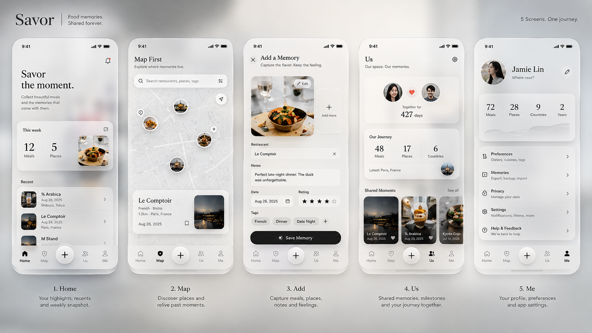

# 🍽️ 垃圾虫和小小琪的觅食记

> 两个人共同记录的美食生活地图，把一起吃过的每一家店，留在地图、时间和照片里。

<p align="center">
  
</p>

## ✨ 关于项目

**垃圾虫和小小琪的觅食记** 是一个为两个人设计的微信小程序。

它不是大众点评，也不只是情侣相册。

这里想记录的是：

**我们在哪里吃过、吃了什么、觉得怎么样，以及那一天发生了什么。**

项目大约由两部分组成：

* 🍜 **50% 美食记录**：餐厅、地点、日期、菜系、人均、菜品、评分、是否值得再去
* 💕 **50% 两个人的回忆**：双方评分、留言、照片、特殊标签与纪念节点

照片是整个产品最重要的视觉载体。

---

## 📱 核心功能

### 🏠 回忆

两个人共同的美食时间轴。

计划包含：

* 一起吃过的餐厅数量
* 最近一次用餐记录
* 最近的美食照片
* 城市 / 餐厅 / 想吃统计
* 美食地图预览
* 一年前的今天
* 纪念节点
* 年度美食报告

### ➕ 记一顿

快速记录一次吃饭经历。

目前记录内容包括：

* 餐厅名称
* 日期
* 城市
* 地址
* 菜系
* 人均消费
* 照片
* 垃圾虫评分
* 小小琪评分
* 菜品
* 一句话回忆

照片会上传到微信云存储，记录保存到云数据库。

### 🗺️ 地图

计划基于微信小程序 `<map>` 与腾讯位置服务展示两个人吃过的餐厅。

同一家餐厅可以去很多次：

```text
餐厅
└── 鼎泰丰 · 静安嘉里中心店
    ├── 2026-08-17 第一次
    └── 2027-03-21 第二次
```

因此项目的数据设计中：

**餐厅实体 ≠ 一次用餐记录。**

未来可以按照城市、菜系、评分、是否值得二刷等条件筛选。

### ❤️ 想吃

两个人共同维护的 Wishlist。

未来支持：

* 添加想吃的餐厅
* 从「想吃」变为「吃过」
* 约会
* 甜品
* 火锅
* 旅行
* 小红书种草
* 自定义标签

### 👩‍❤️‍👨 我们

计划用于：

* 情侣绑定
* 两个人共同编辑数据
* 美食统计
* 年度报告
* 数据管理
* 批量导入

---

## 🚧 当前开发状态

项目正在持续开发中。

目前已经完成 / 正在打通的核心链路：

```text
记一顿
   ↓
上传照片到 CloudBase 云存储
   ↓
mealRecords 云函数
   ↓
dining_records 云数据库
   ↓
返回首页
   ↓
首页自动刷新最新记录
```

目前数据按照微信 OpenID 隔离。

后续将增加 `coupleId` / `memberOpenids`，让两个人可以看到并共同维护同一份美食记录。

---

## 🛠 技术栈

| 部分    | 技术                  |
| ----- | ------------------- |
| 客户端   | 微信原生小程序             |
| UI    | WXML / WXSS         |
| 业务逻辑  | JavaScript          |
| 后端    | 微信云开发 CloudBase     |
| 数据库   | CloudBase 云数据库      |
| 图片    | CloudBase 云存储       |
| 服务端逻辑 | 微信云函数               |
| 地图    | 微信 Map + 腾讯位置服务（规划） |

---

## 📂 仓库结构

```text
savor-us-food-memories/
│
├── README.md                       # 项目首页说明
├── 施工计划.md                      # 产品与开发路线
├── CODEX_PROMPT.md                 # Codex 开发交接提示
├── README_FOR_CODEX.md             # Codex 交接说明
├── REFERENCE_INDEX.md              # 参考资料索引
│
├── references/
│   ├── design/                     # UI / 品牌 / 功能设计稿
│   └── chat_screenshots/           # 开发过程截图
│
├── notes/                          # Bug / 开发交接记录
│
└── source/
    ├── current_project/            # 当前微信小程序源码
    │   ├── miniprogram/            # 小程序前端
    │   ├── cloudfunctions/         # CloudBase 云函数
    │   ├── project.config.json     # 微信开发者工具项目配置
    │   └── STAGE2_SETUP.md         # Stage 2 部署说明
    │
    ├── current_project_original.zip
    └── latest_chat_generated_filterfix.zip
```

实际微信小程序工程位于：

```text
source/current_project/
```

---

## 🚀 本地运行

### 1. 克隆仓库

```bash
git clone https://github.com/Mamroru77/savor-us-food-memories.git
cd savor-us-food-memories
```

### 2. 打开微信开发者工具

选择：

**导入项目**

项目目录选择：

```text
source/current_project
```

这里包含微信开发者工具所需的：

```text
project.config.json
miniprogram/
cloudfunctions/
```

### 3. 配置云开发

确保微信开发者工具已经登录，并且拥有对应小程序及 CloudBase 环境权限。

项目中的 CloudBase 环境配置不要随意替换。

### 4. 部署 `mealRecords` 云函数

在微信开发者工具中找到：

```text
cloudfunctions/mealRecords
```

右键选择：

**上传并部署：云端安装依赖**

### 5. 编译运行

点击微信开发者工具的：

**编译**

进入首页后点击中间的 `+` 或「记下第一顿」，填写记录并保存。

保存成功后会返回首页，并自动刷新最新数据。

---

## ☁️ 数据结构

当前核心集合：

```text
dining_records
```

长期规划中的主要数据集合：

```text
users
couples
restaurants
dining_records
record_members
wishlist
imports
```

核心原则：

```text
Restaurant
餐厅本身

Dining Record
某一天去这家餐厅吃饭的记录
```

一家餐厅可以对应多次 Dining Record。

---

## 🎨 设计方向

整体视觉方向：

**温暖手账感 + 少量可爱情侣感**

主要设计语言：

* 奶油白
* 暖米色
* 浅杏色
* 低饱和粉橘 / 珊瑚色
* 大照片
* 大留白
* 圆角卡片
* 轻阴影
* 少量手绘爱心、星星、餐具和贴纸元素

设计原则是不做过度粉色，也不做儿童化卡通 UI。

设计稿可以在这里查看：

```text
references/design/
```

---

## 🛣️ Roadmap

```text
✅ Stage 1
   静态首页与基础视觉

🚧 Stage 2
   记一顿
   → 图片上传
   → 云函数
   → dining_records
   → 首页刷新

⬜ Stage 3
   两个人 / 情侣绑定
   → coupleId
   → memberOpenids
   → 共同数据

⬜ Stage 4
   餐厅实体 + 多次到访

⬜ Stage 5
   美食地图 + 腾讯位置服务

⬜ Stage 6
   想吃 Wishlist

⬜ Stage 7
   搜索 / 筛选 / 标签

⬜ Stage 8
   批量导入

⬜ Stage 9
   年度报告 / 回忆节点
```

完整产品与开发路线请查看：

[`施工计划.md`](./施工计划.md)

---

## 💡 项目的目标

有一天我们应该可以打开这个小程序，然后看到：

> 原来我们已经一起吃过这么多地方。

地图上的每一个点，不只是一家餐厅。

也是那一天、那顿饭、那张照片，以及两个人共同留下的一小段生活。

---

## 👨‍💻 Development

这个项目仍在开发中，仓库同时保留了开发过程中的设计稿、阶段性源码和 Codex / AI 开发交接资料。

如果继续开发，建议先阅读：

```text
README_FOR_CODEX.md
施工计划.md
notes/
source/current_project/STAGE2_SETUP.md
```

然后以：

```text
source/current_project/
```

作为当前小程序源码进行开发。

---

<p align="center">
  🍜 吃过的店会忘记，照片会沉底。<br/>
  所以我们想把它们放在同一个地方。
</p>
